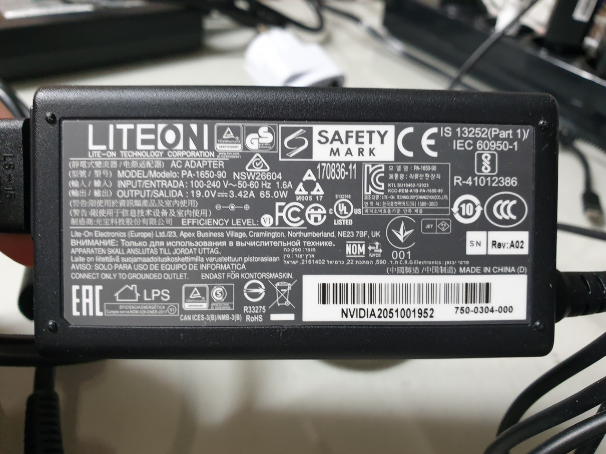
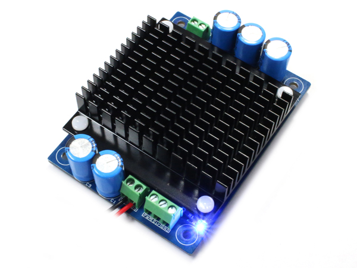
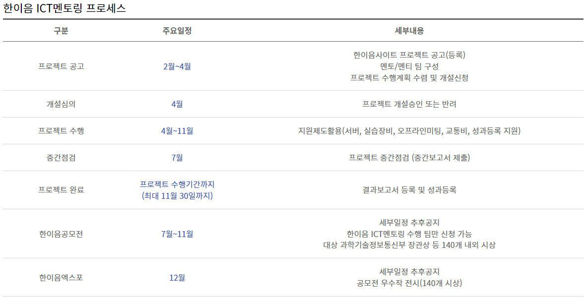

# Paper
- [A Comparison of Path Planning Algorithms for Robotic Vacuum Cleaners](https://kth.diva-portal.org/smash/get/diva2:1214422/FULLTEXT01.pdf)
- [Path planning algorithm development for autonomous vacuum cleaner robots](https://www.researchgate.net/publication/269297110_Path_planning_algorithm_development_for_autonomous_vacuum_cleaner_robots)
- [Experience based Domestic Environment and User Adaptive Cleaning Algorithm of a Robot Cleaner](https://ieeexplore.ieee.org/stamp/stamp.jsp?tp=&arnumber=7057525)

# Video link
- [협업을 위한 모바일 로봇](https://www.youtube.com/watch?v=IeyBXzikhD0)

- [메카넘 휠 구동 영상](https://www.youtube.com/watch?v=_tmiu1wpp_E)

- [CES2022 현대차 MobeD](https://www.youtube.com/watch?v=KeVDFvYofks)

- [로봇 청소기 예제: 양정연 교수님 SLAM 수업](https://www.youtube.com/watch?v=VXVn75VXRMM&list=PL3Ax8f2laJ6vU449FdgWlVl2VtizhDIfj&index=13)

# Parts
## Jetson AGX Xavier
[Spec & Documentation](https://developer.nvidia.com/embedded/jetson-agx-xavier-developer-kit)

[Tech Blog](https://developer.nvidia.com/blog/nvidia-jetson-agx-xavier-32-teraops-ai-robotics/?ncid=so-fac-mdjngxxrmllhml-69163)

[NVIDIA Tutorial](https://developer.nvidia.com/embedded/learn/tutorials)

## Motor
- [IG42GM 02type 24V](https://www.devicemart.co.kr/goods/view?no=1326531)
- 감속비: 1/61
- 18kg-cm // 110PRM // Rated current: 2100mA

## Motor Driver
[DCMD-100-P](https://www.devicemart.co.kr/goods/view?no=1266131)

## Battery
- Jetson
> [노트북 배터리](http://item.gmarket.co.kr/Item?goodscode=1267373161)

- Motor
> 12V, 7400mA, 55C
>
> 12V -> 24V 승압 회로 필요

# Contest Info
## [SRC IRC](http://www.seoultechrobot.com/index.php)

## [KWIX](https://ei.kw.ac.kr/kwix/kwix_18.php)
- 오정현 교수님

## [한이음 ICT멘토링](https://www.hanium.or.kr/portal/hanium/businessOverview.do)

- 멘토: 용호형

