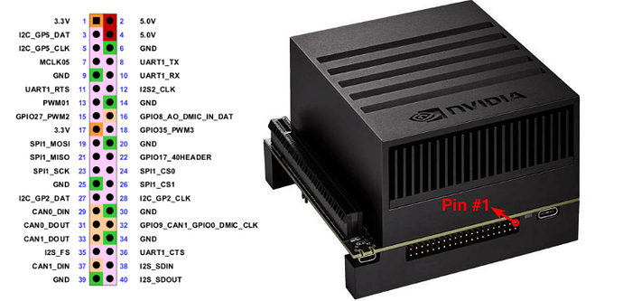

# Paper

# Video link
- [협업을 위한 모바일 로봇](https://www.youtube.com/watch?v=IeyBXzikhD0)

- [메카넘 휠 구동 영상](https://www.youtube.com/watch?v=_tmiu1wpp_E)

- [CES2022 현대차 MobeD](https://www.youtube.com/watch?v=KeVDFvYofks)

# Parts
- Jetson AGX Xavier
> [Spec & Documentation](https://developer.nvidia.com/embedded/jetson-agx-xavier-developer-kit)
>
> [Tech Blog](https://developer.nvidia.com/blog/nvidia-jetson-agx-xavier-32-teraops-ai-robotics/?ncid=so-fac-mdjngxxrmllhml-69163)
>
> [NVIDIA Tutorial](https://developer.nvidia.com/embedded/learn/tutorials)
>
> 
>

# Contest Info
- [2022 ICT 융합 프로젝트 공모전](https://allforyoung.com/posts/12990/)
> 지원 기간: 2022년 2월 1일 ~ 2022년 3월 31일 23:59

- [SRC IRC](http://www.seoultechrobot.com/index.php)

